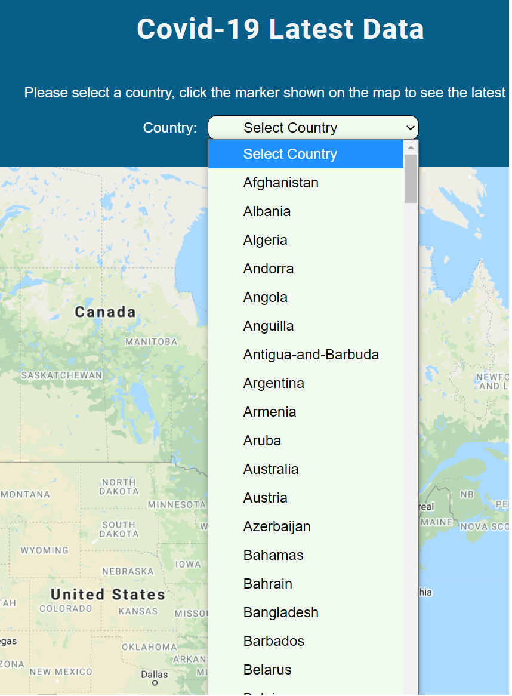
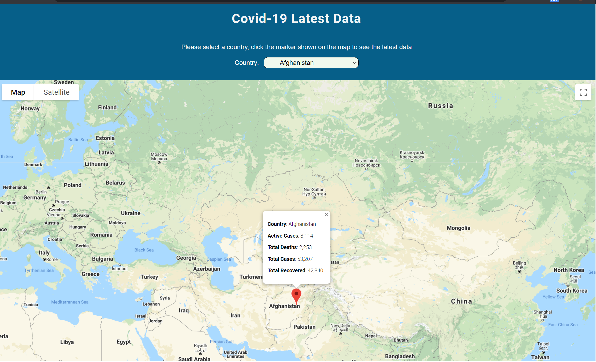

# Covid-19 Latest Data
Users select a country in the dropdown list, then the country will be marked on the map. Click the marker, users can see the Covid-19 latest data of that country.

## Checkout the live website below
[Covid-19 Latest Data](https://yingl1984.github.io/covid19-latest-data/)

## Screenshots
### Load all the countries of the world in the dropdown list

### Mark the selected country in the map. Show the Covid-19 latest data in the information window

## 4 APIs used in this app
1. Google Map API endpoint: 
https://maps.googleapis.com/maps/api
2. Google Geocode API endpoint: 
https://maps.googleapis.com/maps/api/geocode
3. Covid-19 data API endpoint: https://covid-19-tracking.p.rapidapi.com/v1/
4. Countries API: https://covid-193.p.rapidapi.com/countries

## Built With
- Integrate with 3rd party API
- JQuery
- JSON
- HTML
- CSS

